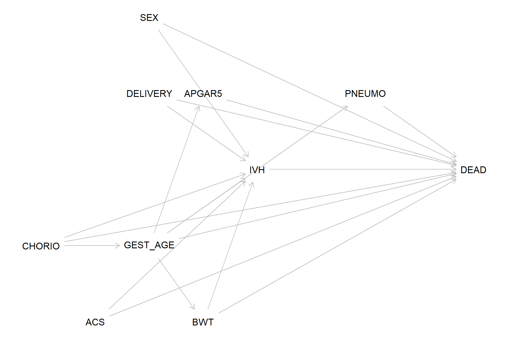

## Literature Review

**Perform a literature review on variables/factors confounding the association between IVH and mortality.**

Based on the literature review, several key risk factors were identified that are associated with both Intraventricular Hemorrhage (IVH) and Neonatal Mortality in Very Low Birth Weight (VLBW) infants.

| Publications (Example Sources) | Potential Confounding Factors | Association w/ IVH | Estimates (95% CI) | Association w/ Mortality | Estimates (95% CI) |
| :--- | :--- | :--- | :--- | :--- | :--- |
| [*Wei et al. (2016)*](https://doi.org/10.1038/jp.2016.38) / [*Roberts et al. (2017)*](https://doi.org/10.1002/14651858.CD004454.pub3) | **Antenatal Corticosteroids (ACS)** | Protective (Reduces IVH risk) | Severe IVH: OR = 0.51 (0.45-0.58) [[1]](https://doi.org/10.1038/jp.2016.38) | Protective (Reduces Mortality) | Neonatal death: RR = 0.69 (0.58-0.81) [[2]](https://doi.org/10.1002/14651858.CD004454.pub3) |
| [*Villamor-Martinez et al. (2018)*](https://doi.org/10.3389/fphys.2018.01253) | **Chorioamnionitis (Clinical/Histological)** | Risk Factor (Increases IVH risk) | OR = 1.88 (1.61-2.19) [[3]](https://doi.org/10.3389/fphys.2018.01253) | Associated with prematurity/sepsis pathways | (Estimates vary by outcome definition/study) |
| *HW1 Data / Literature* | **Gestational Age** | Strong Negative Assoc. | (See HW1 results) | Strong Negative Assoc. | (See HW1 results) |
| *HW1 Data / Literature* | **Birth Weight** | Strong Negative Assoc. | (See HW1 results) | Strong Negative Assoc. | (See HW1 results) |
| [*Zhao et al. (2022)*](https://doi.org/10.1186/s12884-022-05245-2) / [*Lee et al. (2010)*](https://doi.org/10.1111/j.1651-2227.2010.01935.x) | **Low 5-min Apgar score** | Risk Factor (Increases IVH risk) | Apgar <=7: OR = 2.273 (1.163-4.442) [[4]](https://doi.org/10.1186/s12884-022-05245-2) | Risk Factor (Increases Mortality) | Example (24 wks): RR = 3.1 (2.9-3.4) for Apgar 0-3 vs 7-10 [[5]](https://doi.org/10.1111/j.1651-2227.2010.01935.x) |

---

## Directed Acyclic Graph (DAG)

**Draw a Directed Acyclic Graph (DAG) to illustrate the conceptual framework of the causal association between IVH and infant death.**

Below is the DAG written in **DAGitty syntax** (copy/paste into [https://dagitty.net/dags.html](https://dagitty.net/dags.html)):

{ width=92% }

**DAGitty Code:**

\begin{tcolorbox}[
  colback=SoftGray,
  colframe=TitleBlue,
  boxrule=0.5pt,
  arc=2pt,
  left=6pt,right=6pt,top=6pt,bottom=6pt,
  before skip=4pt, after skip=10pt
]
\begingroup\footnotesize
\noindent\begin{minipage}[t]{0.49\linewidth}
\begin{verbatim}
dag {
bb="-1,-1,9,6"

IVH [exposure,pos="4,3"]
DEAD [outcome,pos="8,3"]
GEST_AGE [pos="2,4"]
BWT [pos="3,5"]
ACS [pos="1,5"]
CHORIO [pos="0,4"]
DELIVERY [pos="2,2"]
APGAR5 [pos="3,2"]
SEX [pos="2,1"]
PNEUMO [pos="6,2"]

IVH -> DEAD
IVH -> PNEUMO
PNEUMO -> DEAD

GEST_AGE -> IVH
GEST_AGE -> DEAD
GEST_AGE -> BWT
GEST_AGE -> APGAR5
GEST_AGE -> PNEUMO

BWT -> IVH
BWT -> DEAD
\end{verbatim}
\end{minipage}\hfill
\begin{minipage}[t]{0.49\linewidth}
\begin{verbatim}
ACS -> IVH
ACS -> DEAD

CHORIO -> GEST_AGE
CHORIO -> IVH
CHORIO -> DEAD

DELIVERY -> IVH
DELIVERY -> DEAD

APGAR5 -> IVH
APGAR5 -> DEAD

SEX -> IVH
SEX -> DEAD
}
\end{verbatim}
\end{minipage}
\endgroup
\end{tcolorbox}

**DAGitty analysis (for total effect of IVH on death):**
- Minimal sufficient adjustment set identified by this DAG:  
  `{GEST_AGE, BWT, ACS, CHORIO, DELIVERY, APGAR5, SEX}`
- `PNEUMO` is modeled as a post-exposure mediator (`IVH -> PNEUMO -> DEAD`), so it should **not** be adjusted for when estimating the total causal effect of IVH.

---

## Comparison with HW1 Model

**Compare variables identified in the DAG to the covariates included in the adjusted regression model in Homework 1.**

1. **Covariates in HW1 adjusted model:** `pneumo`, `bwt_cat`, `gest_cat`.

2. **DAGitty-based target adjustment set (if sample size is not limiting):**  
   `GEST_AGE`, `BWT`, `ACS`, `CHORIO`, `DELIVERY`, `APGAR5`, `SEX`.

3. **Variables missing from HW1 (relative to DAGitty set):**
   - `ACS` (antenatal corticosteroids)
   - `CHORIO` (chorioamnionitis)
   - `DELIVERY` (delivery mode)
   - `APGAR5` (5-min Apgar)
   - `SEX` (infant sex)

4. **Role of pneumothorax in causal modeling:**
   - In this DAG, pneumothorax is primarily post-exposure and on the pathway `IVH -> PNEUMO -> DEAD`.
   - Therefore, for estimating the **total effect** of IVH on mortality, pneumothorax should not be adjusted for.
   - If the research target were a controlled direct effect (not total effect), mediation-oriented methods would be required.

5. **Conclusion for HW2 Question 3:**
   - Yes, additional confounders should have been included if data and sample size allowed.
   - I would add back `ACS`, `CHORIO`, `DELIVERY`, `APGAR5`, and `SEX`, and avoid routine adjustment for `pneumo` in the primary total-effect model.

---

## E-Values Calculation

**Calculate the E-values for the exposure of interest (IVH). Do you think the association is likely to be explained away by unmeasured confounders?**

**Data from Homework 1 (Poisson Model):**
*   **Adjusted Risk Ratio ($RR_{obs}$)**: 2.059 (from HW1 final Poisson model)
*   **95% Confidence Interval**: 1.351 - 3.137

**Formula:**
$$ E\text{-value} = RR + \sqrt{RR \times (RR - 1)} $$

**Computed with R (`EValue` package; confirmed by manual formula):**

1.  **E-value for point estimate** ($RR=2.059$):  
    $$ \mathbf{E = 3.536} $$

2.  **E-value for lower confidence limit** ($LL=1.351$):  
    $$ \mathbf{E_{LL} = 2.040} $$

**Interpretation:**
*   To explain away the observed risk ratio of 2.059, an unmeasured confounder would need to have an association with both IVH and death of at least **RR = 3.536**, conditional on measured covariates.
*   To move the lower CI bound to the null, an unmeasured confounder would still need an association of at least **RR = 2.040** with both exposure and outcome.

**Conclusion:**
*   An E-value of 3.536 is relatively large in this clinical context. Few single unmeasured confounders (e.g., chorioamnionitis with effect sizes often around 1.9-2.2) are likely to be strong enough on both links after adjustment for prematurity-related factors.
*   Therefore, it is **unlikely** that the observed association between IVH and infant mortality is entirely explained away by unmeasured confounding. The evidence supports IVH as an independent risk factor.

---

## References

1. Wei JC, Catalano R, Profit J, Gould JB, Lee HC. Impact of antenatal steroids on intraventricular hemorrhage in very-low-birth weight infants. *J Perinatol*. 2016;36(5):352-356. doi: [10.1038/jp.2016.38](https://doi.org/10.1038/jp.2016.38)
2. Roberts D, Brown J, Medley N, Dalziel SR. Antenatal corticosteroids for accelerating fetal lung maturation for women at risk of preterm birth. *Cochrane Database Syst Rev*. 2017;3(3):CD004454. doi: [10.1002/14651858.CD004454.pub3](https://doi.org/10.1002/14651858.CD004454.pub3)
3. Villamor-Martinez E, et al. Chorioamnionitis is a risk factor for intraventricular hemorrhage in preterm infants: a systematic review and meta-analysis. *Front Physiol*. 2018;9:1253. doi: [10.3389/fphys.2018.01253](https://doi.org/10.3389/fphys.2018.01253)
4. Zhao Y, Zhang W, Tian X. Analysis of risk factors of early intraventricular hemorrhage in very-low-birth-weight premature infants: a single center retrospective study. *BMC Pregnancy Childbirth*. 2022;22:890. doi: [10.1186/s12884-022-05245-2](https://doi.org/10.1186/s12884-022-05245-2)
5. Lee HC, Subeh M, Gould JB. Low Apgar score and mortality in extremely preterm neonates born in the United States. *Acta Paediatr*. 2010;99(12):1785-1789. doi: [10.1111/j.1651-2227.2010.01935.x](https://doi.org/10.1111/j.1651-2227.2010.01935.x)
