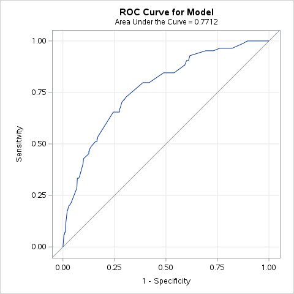
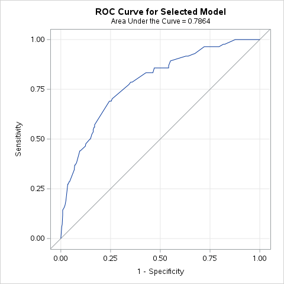
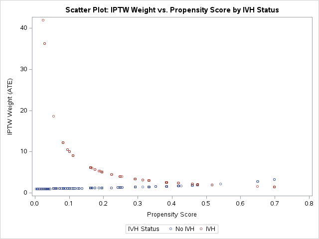

## Introduction

In this homework, I used **Inverse Probability of Treatment Weighting (IPTW)** to study the association between intraventricular hemorrhage (IVH) and neonatal mortality among very low birth weight (VLBW) infants. The cohort includes 514 infants with birth weight below 1,600 g born at Duke University Medical Center from 1981 to 1987. The exposure is IVH (ivh2 = 1 in 84 infants, 16.3%), and the outcome is in-hospital death (dead = 1 in 99 infants, 19.3%).

Unlike propensity score matching in HW3, IPTW keeps the whole cohort and reweights subjects based on the probability of their observed exposure. I used the **Average Treatment Effect (ATE)** estimand, with weight $1/\hat{e}$ for exposed infants and $1/(1-\hat{e})$ for unexposed infants.

I also compared the IPTW results with the unadjusted model, the multivariable model from HW1, and the PS-matched results from HW3.

---

## Requirement 1: PS Step 1 Model — Model Selection

### Propensity Score Model Specification

The propensity score is defined as the conditional probability of having IVH given pre-treatment baseline covariates: pneumothorax (pneumo), multiple gestation (twin), mode of delivery (Delivery_new), birth location (Inout_new), birth weight category (bwt_cat), and gestational age category (gest_cat). Two logistic regression models were fitted:

- **Model A (No Interactions):** Main effects only — six covariates, no interaction terms.
- **Model B (Two-Way Interactions, Backward):** All pairwise interaction terms, backward stepwise at SLS = 0.20.

### ROC Curves

| Model A (No Interactions) | Model B (Two-Way Interactions) |
| :---: | :---: |
| {width=45%} | {width=45%} |
| C-statistic = 0.771 | C-statistic = 0.786 |
| H-L Goodness-of-Fit p = 0.8742 | H-L Goodness-of-Fit p = 0.8311 |
| N of IPTW cohort = 514 | N of IPTW cohort = 514 |

### Model Fit Statistics

| Criterion | Model A (No Interactions) | Model B (Interactions, Backward) |
| :--- | :---: | :---: |
| C-statistic (AUC) | 0.771 | 0.786 |
| Hosmer-Lemeshow p-value | 0.8742 | 0.8311 |
| Full cohort size (IPTW) | 514 | 514 |

### Balance Diagnostics — SMD After IPTW Weighting

The key criterion for selecting the final PS step 1 model is **covariate balance after IPTW weighting**, measured by standardized mean differences (SMD). An SMD < 0.10 indicates good balance; SMD < 0.20 is acceptable for smaller samples.

**Standardized mean differences before and after IPTW weighting — Model A (ATE):**

| Obs | VarName | Stddiff (Before) | Stddiff (After IPTW) |
| :---: | :--- | :---: | :---: |
| 1 | pneumo\_yes | −0.538 | −0.016 |
| 2 | twin\_yes | 0.418 | −0.008 |
| 3 | delivery\_vag | −0.398 | 0.002 |
| 4 | inout\_transport | −0.494 | 0.049 |
| 5 | bwt\_lt1000 | −0.354 | 0.104 |
| 6 | bwt\_1000\_1299 | 0.079 | −0.124 |
| 7 | gest\_lt28 | −0.448 | 0.015 |
| 8 | gest\_28\_31 | 0.188 | −0.074 |
| | **Max \|SMD\|** | **0.538** | **0.124** |

**Standardized mean differences before and after IPTW weighting — Model B (interactions, backward SLS = 0.20):**

| Obs | VarName | Stddiff (Before) | Stddiff (After IPTW) |
| :---: | :--- | :---: | :---: |
| 1 | pneumo\_yes | −0.538 | −0.033 |
| 2 | twin\_yes | 0.418 | −0.098 |
| 3 | delivery\_vag | −0.398 | 0.040 |
| 4 | inout\_transport | −0.494 | 0.043 |
| 5 | bwt\_lt1000 | −0.354 | 0.070 |
| 6 | bwt\_1000\_1299 | 0.079 | 0.162 |
| 7 | gest\_lt28 | −0.448 | 0.042 |
| 8 | gest\_28\_31 | 0.188 | 0.100 |
| | **Max \|SMD\|** | **0.538** | **0.162** |

### Final Model Selection: Model A

I selected **Model A (no interactions)** as the final PS step 1 model. Model B had a slightly higher AUC (0.786 vs. 0.771), but the weighted balance was better for Model A: the largest absolute SMD was **0.124** for Model A compared with **0.162** for Model B. Since the goal of the PS model is balance rather than prediction alone, Model A was the better choice for this homework.

### Model A: Parameter Estimates

| Covariate | Level | OR | 95% CI | p-value |
| :--- | :--- | :---: | :---: | :---: |
| Pneumothorax | Yes vs. No | 3.712 | (2.073, 6.648) | < 0.001 |
| Multiple Gestation | Yes vs. No | 0.319 | (0.136, 0.751) | 0.009 |
| Mode of Delivery | Vaginal vs. C-Section | 2.178 | (1.234, 3.844) | 0.007 |
| Birth Location | Transport vs. Duke | 2.571 | (1.458, 4.535) | 0.001 |
| Birth Weight | < 1000g vs. $\geq$ 1300g | 1.954 | (0.785, 4.861) | 0.150 |
| Birth Weight | 1000–1299g vs. $\geq$ 1300g | 1.564 | (0.711, 3.440) | 0.266 |
| Gestational Age | < 28 wks vs. $\geq$ 32 wks | 5.093 | (1.028, 25.221) | 0.046 |
| Gestational Age | 28–31 wks vs. $\geq$ 32 wks | 5.063 | (1.145, 22.400) | 0.033 |

*C-statistic = 0.771. Significant predictors of IVH: pneumothorax, mode of delivery, birth location, and gestational age.*

---

## Requirement 2: Table 1 — Baseline Characteristics Before and After IPTW

IPTW for ATE was computed as follows:

- Treated (IVH = 1): $w = 1 / \hat{e}$, where $\hat{e}$ = propensity score
- Control (IVH = 0): $w = 1 / (1 - \hat{e})$

These weights up-weight subjects whose covariate profile is "unusual" for their treatment group, creating a pseudo-population that mirrors the overall covariate distribution in both exposure arms.

### Table 1: Baseline Characteristics by IVH Status — Original Cohort (N = 514)

| Covariate | No IVH (N = 430) | IVH (N = 84) | p-value | SMD (Unweighted) |
| :--- | :---: | :---: | :---: | :---: |
| **Pneumothorax** | | | **< 0.001** | 0.538 |
| &emsp;No | 357 (83.0%) | 50 (59.5%) | | |
| &emsp;Yes | 73 (17.0%) | 34 (40.5%) | | |
| **Multiple Gestation** | | | 0.002 | 0.418 |
| &emsp;Singleton | 330 (76.7%) | 77 (91.7%) | | |
| &emsp;Multiple | 100 (23.3%) | 7 (8.3%) | | |
| **Mode of Delivery** | | | 0.001 | 0.398 |
| &emsp;C-Section | 221 (51.4%) | 27 (32.1%) | | |
| &emsp;Vaginal | 209 (48.6%) | 57 (67.9%) | | |
| **Birth Location** | | | **< 0.001** | 0.494 |
| &emsp;Born at Duke | 366 (85.1%) | 54 (64.3%) | | |
| &emsp;Transport | 64 (14.9%) | 30 (35.7%) | | |
| **Birth Weight Category** | | | 0.004 | 0.354 |
| &emsp;< 1000 g | 146 (34.0%) | 43 (51.2%) | | |
| &emsp;1000–1299 g | 170 (39.5%) | 30 (35.7%) | | |
| &emsp;1300–1599 g | 114 (26.5%) | 11 (13.1%) | | |
| **Gestational Age Category** | | | **< 0.001** | 0.448 |
| &emsp;< 28 weeks | 114 (26.5%) | 40 (47.6%) | | |
| &emsp;28–31 weeks | 255 (59.3%) | 42 (50.0%) | | |
| &emsp;$\geq$ 32 weeks | 61 (14.2%) | 2 (2.4%) | | |

*Column percentages and chi-square p-values are shown. In the original cohort, the IVH and No-IVH groups were clearly different on all six baseline covariates.*

---

### Table 1: Baseline Characteristics by IVH Status — PS-IPTW Weighted Cohort (ATE, N = 514)

All 514 infants were retained in the IPTW analysis. ATE weights ($w = 1/\hat{e}$ for IVH = 1; $w = 1/(1-\hat{e})$ for IVH = 0) were applied. The weighted pseudo-population totals were 514.5 (No IVH) and 511.4 (IVH).

| Covariate | No IVH (Weighted N) | No IVH % | IVH (Weighted N) | IVH % | p-value | Std Diff |
| :--- | :---: | :---: | :---: | :---: | :---: | :---: |
| **Total** | **514.5** | | **511.4** | | | |
| **Pneumothorax** | | | | | 0.779 | 0.016 |
| &emsp;No | 406.1 | 79.0% | 400.0 | 78.2% | | |
| &emsp;Yes | 108.3 | 21.1% | 111.3 | 21.8% | | |
| **Multiple Gestation** | | | | | 0.915 | 0.008 |
| &emsp;Singleton | 407.3 | 79.2% | 403.5 | 78.9% | | |
| &emsp;Multiple | 107.2 | 20.8% | 107.9 | 21.1% | | |
| **Mode of Delivery** | | | | | 0.979 | 0.002 |
| &emsp;C-Section | 248.0 | 48.2% | 246.9 | 48.3% | | |
| &emsp;Vaginal | 266.5 | 51.8% | 264.4 | 51.7% | | |
| **Birth Location** | | | | | 0.378 | 0.049 |
| &emsp;Born at Duke | 419.7 | 81.6% | 427.8 | 83.7% | | |
| &emsp;Transport | 94.8 | 18.4% | 83.6 | 16.3% | | |
| **Birth Weight Category** | | | | | 0.122 | 0.124 |
| &emsp;< 1000 g | 186.6 | 36.3% | 159.6 | 31.2% | | |
| &emsp;1000–1299 g | 202.3 | 39.3% | 231.7 | 45.3% | | |
| &emsp;1300–1599 g | 125.6 | 24.4% | 120.0 | 23.5% | | |
| **Gestational Age Category** | | | | | 0.252 | 0.074 |
| &emsp;< 28 weeks | 153.8 | 29.9% | 149.3 | 29.2% | | |
| &emsp;28–31 weeks | 297.8 | 57.9% | 314.8 | 61.6% | | |
| &emsp;$\geq$ 32 weeks | 62.9 | 12.2% | 47.2 | 9.2% | | |

*Weighted N and column percentages are shown. All p-values > 0.05 indicate no statistically significant imbalance after weighting. IPTW substantially reduced baseline imbalance; maximum |SMD| = 0.124 (birth weight category).*

**Plain-language interpretation of Table 1:**

Before weighting, the IVH group and the No-IVH group were quite different. Infants with IVH were generally more premature, had lower birth weight, and were more likely to have pneumothorax. Because of that, a crude comparison of mortality would mix the effect of IVH with the effect of baseline illness severity.

After IPTW, the two groups looked much more similar. This means the weighted comparison is fairer than the unadjusted comparison. Still, the balance was not perfect, especially for birth-weight category, so the IPTW estimate should be interpreted carefully.

---

## Requirement 3: PS and IPTW Weight Distribution

### Propensity Score Distribution

Under the final Model A, the propensity score ranged from **0.004 to 0.699**. As expected, infants with IVH had higher propensity scores than infants without IVH (mean 0.286 vs. 0.139).

| Group | N | Mean PS | Median PS | SD | Min | Max |
| :--- | :---: | :---: | :---: | :---: | :---: | :---: |
| No IVH (IVH = 0) | 430 | 0.139 | 0.100 | 0.121 | 0.004 | 0.699 |
| IVH (IVH = 1) | 84 | 0.286 | 0.248 | 0.174 | 0.024 | 0.699 |

### IPTW Weight Distribution

ATE weights are computed as $w = 1/\hat{e}$ for IVH = 1 and $w = 1/(1-\hat{e})$ for IVH = 0. Subjects with extreme propensity scores receive very large weights, potentially causing instability. All weights were reviewed for extreme values.

| Group | N | Mean Weight | Median Weight | SD | Min | Max |
| :--- | :---: | :---: | :---: | :---: | :---: | :---: |
| No IVH (IVH = 0) | 430 | 1.196 | 1.112 | 0.263 | 1.004 | 3.320 |
| IVH (IVH = 1) | 84 | 6.088 | 4.033 | 7.031 | 1.431 | 41.940 |

*The maximum weight for IVH-exposed infants was **41.94**. This means a small number of observations had a large influence on the weighted analysis. I did not truncate the weights in the main analysis, but this is an important limitation.*

### Scatter Plot: IPTW Weight vs. Estimated Propensity Score (ATE)

{width=80%}

The scatter plot of IPTW weight versus propensity score illustrates the inverse relationship between PS and weight within each exposure group:

- **IVH-exposed infants (IVH = 1):** Higher weights at lower propensity scores (infants unlikely to have IVH but who did). These cases are up-weighted because they provide information about the counterfactual outcome for "low-risk" infants.
- **Unexposed infants (IVH = 0):** Higher weights at higher propensity scores (infants likely to have IVH who did not). These are up-weighted as they approximate the counterfactual for "high-risk" infants.

**Plain-language interpretation:** The scatter plot shows that infants with an exposure status that was less expected from their baseline characteristics got larger weights. In this dataset, a few IVH infants had especially large weights, so those cases had a strong effect on the final IPTW estimate.

---

## Requirement 4: Table 2 — Comprehensive Comparison of Effect Estimates

I compared four approaches for the IVH-mortality association:

1. **Unadjusted:** Simple regression (no covariate adjustment).
2. **Adjusted (HW1):** Multivariable regression with purposeful variable selection (IVH + pneumothorax + bwt_cat + gest_cat).
3. **PS-Matched (HW3):** Conditional logistic regression / GEE Poisson, stratified on matched pair ID (164 infants, 82 pairs).
4. **PS-IPTW (HW4):** Weighted GEE with IPTW (ATE), full cohort N = 514.

### Table 2: Effect Estimates — IVH vs. No IVH on Mortality

| | Dead = 0 | Dead = 1 | ORs (95% CI) | RRs (95% CI) |
| :--- | :---: | :---: | :---: | :---: |
| **IVH** | | | | |
| &emsp;No | 372 (86.5%) | 58 (13.5%) | Referent | Referent |
| &emsp;Yes | 43 (51.2%) | 41 (48.8%) | | |
| **Unadjusted** | | | 6.12 (3.67, 10.18) | 3.62 (2.43, 5.40) |
| **Adjusted ORs/RRs** | | | | |
| &emsp;Multivariable model (HW1 purposeful selection) | | | 4.15 (2.29, 7.52) | 2.06 (1.35, 3.14) |
| &emsp;PS Matched (HW3, 82 pairs) | | | 3.86 (1.68, 8.86) | 2.05 (1.35, 3.12) |
| &emsp;**PS IPTW ATE (HW4)** | | | **3.34 (1.65, 6.76)** | **2.45 (1.53, 3.90)** |

*Dead = 0/1 counts show row percentages from the original unweighted cohort (N = 514). Multivariable model (HW1): purposeful selection includes IVH + pneumothorax + bwt_cat + gest_cat. PS Matched: conditional logistic (OR) / GEE Poisson (RR), stratified on MatchID. PS IPTW: GEE binomial logit (OR) / GEE Poisson log-link (RR) with ATE weights and robust variance estimator. All estimates: p < 0.001.*

**Plain-language interpretation of Table 2:**

- **Unadjusted (OR = 6.12; RR = 3.62):** In the crude analysis, infants with IVH had a much higher risk of death than infants without IVH. This estimate is probably too large because the IVH group was also sicker at baseline.

- **Multivariable-adjusted, HW1 (OR = 4.15; RR = 2.06):** After adjusting for pneumothorax, birth weight, and gestational age, the estimate became smaller. This shows that confounding was important, but IVH still remained associated with about a two-fold higher risk of death.

- **PS-Matched, HW3 (OR = 3.86; RR = 2.05):** The matched analysis gave almost the same RR as the HW1 adjusted model. That is helpful because two different adjustment methods gave very similar results.

- **PS-IPTW ATE, HW4 (OR = 3.34; RR = 2.45):** The IPTW analysis also showed higher mortality in the IVH group. The weighted RR was a little larger than the HW1 and HW3 estimates, which may be related to the large IPTW weights and the remaining imbalance after weighting.

- **Preferred measure and conclusion:** I prefer the **risk ratio** here because death is not a rare outcome in this dataset, especially among infants with IVH. The main IPTW estimate for this homework is **RR = 2.45 (95% CI: 1.53, 3.90)**, but it should be read together with the evidence of extreme weights and some residual imbalance.

Overall, all four approaches point in the same direction: IVH is associated with higher neonatal mortality in VLBW infants. The HW1 adjusted model and the HW3 matched model were very close to each other, while the HW4 IPTW estimate was somewhat larger. For that reason, I think the overall conclusion is stable, but the exact IPTW effect size is less certain because of the large weights.

---

## Summary

Using the main-effects PS model (Model A, C-statistic = 0.771), IPTW improved covariate balance in the full cohort of 514 infants. After weighting, all absolute SMDs were below 0.20, although birth-weight category still showed the most residual imbalance (max |SMD| = 0.124). The final IPTW estimate was RR = 2.45 (95% CI: 1.53–3.90), which was in the same direction as the HW1 and HW3 results but somewhat larger. My overall conclusion is that IVH is associated with higher mortality, but the IPTW estimate should be interpreted with caution because some weights were very large.
