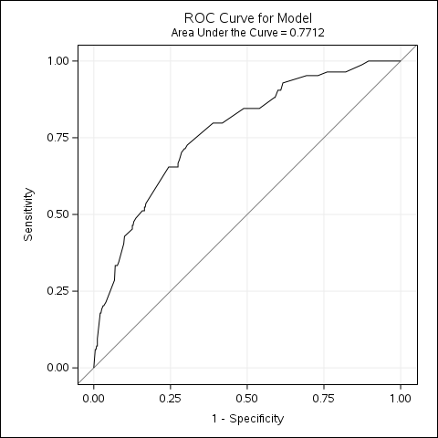
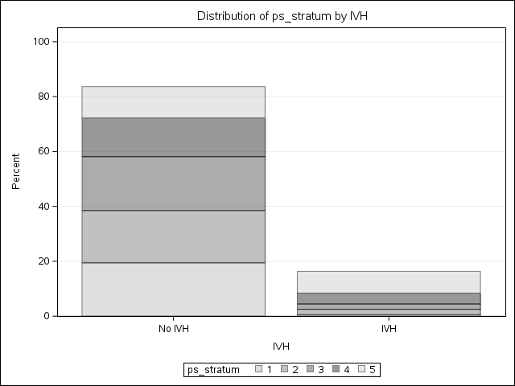
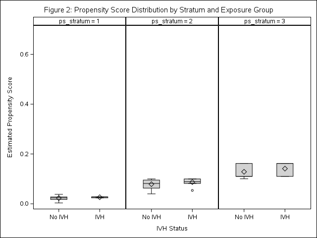
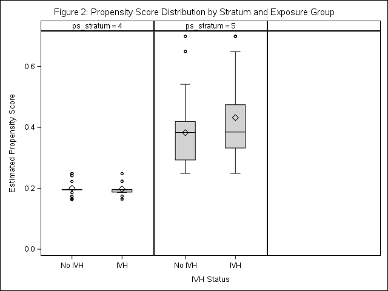

## Introduction

In this homework, I used **propensity score (PS) stratification** and **PS regression** to study the association between intraventricular hemorrhage (IVH) and neonatal mortality among very low birth weight (VLBW) infants. The cohort includes 514 infants with birth weight below 1,600 g born at Duke University Medical Center from 1981 to 1987. The exposure is IVH (`ivh2 = 1` in 84 infants, 16.3%), and the outcome is in-hospital death (`dead = 1` in 99 infants, 19.3%).

This homework extends the earlier analyses from HW1, HW3, and HW4. Instead of adjusting for confounders only through conventional regression, I first estimated each infant's probability of having IVH based on measured baseline characteristics, then used that propensity score in two additional ways:

- **PS stratification:** divide the cohort into five quintile strata and compare outcomes across exposure groups within strata.
- **PS regression:** include the estimated PS directly in the outcome model as an adjustment variable.

I also compared the HW5 results with the unadjusted model from HW1, the multivariable model from HW1, the PS-matched results from HW3, and the PS-IPTW results from HW4.

---

## Requirement 1: PS Step 1 Model

### Propensity Score Model Specification

Following the homework instructions, I fit a **simple PS step 1 logistic regression model without interaction terms**, using IVH as the response variable and the measured baseline confounders as predictors:

- Pneumothorax (`pneumo`)
- Multiple gestation (`twin`)
- Mode of delivery (`delivery_new`)
- Birth location (`inout_new`)
- Birth weight category (`bwt_cat`)
- Gestational age category (`gest_cat`)

### ROC Curve and Model Fit

{ width=60% }

The main-effects PS model had **C-statistic = 0.771**, indicating acceptable discrimination between infants with and without IVH. This is the same step 1 model used in HW3 and HW4, which supports consistency across the propensity score analyses.

### Model A: Parameter Estimates

| Covariate | Level | OR | 95% CI | p-value |
| :--- | :--- | :---: | :---: | :---: |
| Pneumothorax | Yes vs. No | 3.712 | (2.073, 6.648) | < 0.001 |
| Multiple Gestation | Yes vs. No | 0.319 | (0.136, 0.751) | 0.009 |
| Mode of Delivery | Vaginal vs. C-Section | 2.178 | (1.234, 3.844) | 0.007 |
| Birth Location | Transport vs. Duke | 2.571 | (1.458, 4.535) | 0.001 |
| Birth Weight | < 1000g vs. $\geq$ 1300g | 1.954 | (0.785, 4.861) | 0.150 |
| Birth Weight | 1000-1299g vs. $\geq$ 1300g | 1.564 | (0.711, 3.440) | 0.266 |
| Gestational Age | < 28 wks vs. $\geq$ 32 wks | 5.093 | (1.028, 25.221) | 0.046 |
| Gestational Age | 28-31 wks vs. $\geq$ 32 wks | 5.063 | (1.145, 22.400) | 0.033 |

*C-statistic = 0.771. Significant predictors of IVH were pneumothorax, multiple gestation, mode of delivery, birth location, and gestational age.*

### PS Quintile Definition

After estimating the PS for each infant, I ranked the predicted scores and created **five PS quintile strata**. All 514 infants were retained.

| Stratum | PS Range | Total N | No IVH | IVH |
| ---: | :--- | ---: | ---: | ---: |
| 1 | 0.0036-0.0380 | 103 | 100 | 3 |
| 2 | 0.0400-0.0999 | 103 | 96 | 7 |
| 3 | 0.0999-0.1621 | 102 | 95 | 7 |
| 4 | 0.1621-0.2479 | 103 | 79 | 24 |
| 5 | 0.2479-0.6988 | 103 | 60 | 43 |

This table shows that infants with IVH were concentrated in the higher-propensity strata. More than half of the exposed infants were in stratum 5, whereas only 3 infants with IVH were in stratum 1.

---

## Requirement 2: Table 1 — Baseline Characteristics Within PS Strata

The homework asked for Table 1 to be presented by strata, with **column percentages by exposure group**. Because the first three strata contained very few IVH-exposed infants, I report descriptive percentages without emphasizing formal p-values. The main purpose of this table is to show how the exposed and unexposed infants compare within each PS risk band.

### Table 1: Baseline Characteristics by IVH Status Within PS Quintile Strata

| Stratum | Covariate | No IVH | IVH |
| :--- | :--- | :---: | :---: |
| **1** | **PS range 0.0036-0.0380; N = 103** | **100** | **3** |
|  | Pneumothorax: No | 100 (100.0%) | 3 (100.0%) |
|  | Pneumothorax: Yes | 0 (0.0%) | 0 (0.0%) |
|  | Multiple gestation: Singleton | 38 (38.0%) | 1 (33.3%) |
|  | Multiple gestation: Multiple | 62 (62.0%) | 2 (66.7%) |
|  | Delivery: C-Section | 73 (73.0%) | 2 (66.7%) |
|  | Delivery: Vaginal | 27 (27.0%) | 1 (33.3%) |
|  | Birth location: Born at Duke | 95 (95.0%) | 3 (100.0%) |
|  | Birth location: Transport | 5 (5.0%) | 0 (0.0%) |
|  | Birth weight: <1000 g | 9 (9.0%) | 0 (0.0%) |
|  | Birth weight: 1000-1299 g | 45 (45.0%) | 2 (66.7%) |
|  | Birth weight: 1300-1599 g | 46 (46.0%) | 1 (33.3%) |
|  | Gestational age: <28 weeks | 3 (3.0%) | 0 (0.0%) |
|  | Gestational age: 28-31 weeks | 48 (48.0%) | 2 (66.7%) |
|  | Gestational age: $\geq$32 weeks | 49 (49.0%) | 1 (33.3%) |
| **2** | **PS range 0.0400-0.0999; N = 103** | **96** | **7** |
|  | Pneumothorax: No | 84 (87.5%) | 5 (71.4%) |
|  | Pneumothorax: Yes | 12 (12.5%) | 2 (28.6%) |
|  | Multiple gestation: Singleton | 77 (80.2%) | 5 (71.4%) |
|  | Multiple gestation: Multiple | 19 (19.8%) | 2 (28.6%) |
|  | Delivery: C-Section | 81 (84.4%) | 7 (100.0%) |
|  | Delivery: Vaginal | 15 (15.6%) | 0 (0.0%) |
|  | Birth location: Born at Duke | 88 (91.7%) | 7 (100.0%) |
|  | Birth location: Transport | 8 (8.3%) | 0 (0.0%) |
|  | Birth weight: <1000 g | 26 (27.1%) | 0 (0.0%) |
|  | Birth weight: 1000-1299 g | 49 (51.0%) | 6 (85.7%) |
|  | Birth weight: 1300-1599 g | 21 (21.9%) | 1 (14.3%) |
|  | Gestational age: <28 weeks | 9 (9.4%) | 2 (28.6%) |
|  | Gestational age: 28-31 weeks | 77 (80.2%) | 5 (71.4%) |
|  | Gestational age: $\geq$32 weeks | 10 (10.4%) | 0 (0.0%) |
| **3** | **PS range 0.0999-0.1621; N = 102** | **95** | **7** |
|  | Pneumothorax: No | 86 (90.5%) | 7 (100.0%) |
|  | Pneumothorax: Yes | 9 (9.5%) | 0 (0.0%) |
|  | Multiple gestation: Singleton | 85 (89.5%) | 7 (100.0%) |
|  | Multiple gestation: Multiple | 10 (10.5%) | 0 (0.0%) |
|  | Delivery: C-Section | 30 (31.6%) | 3 (42.9%) |
|  | Delivery: Vaginal | 65 (68.4%) | 4 (57.1%) |
|  | Birth location: Born at Duke | 89 (93.7%) | 7 (100.0%) |
|  | Birth location: Transport | 6 (6.3%) | 0 (0.0%) |
|  | Birth weight: <1000 g | 27 (28.4%) | 3 (42.9%) |
|  | Birth weight: 1000-1299 g | 32 (33.7%) | 0 (0.0%) |
|  | Birth weight: 1300-1599 g | 36 (37.9%) | 4 (57.1%) |
|  | Gestational age: <28 weeks | 24 (25.3%) | 0 (0.0%) |
|  | Gestational age: 28-31 weeks | 69 (72.6%) | 7 (100.0%) |
|  | Gestational age: $\geq$32 weeks | 2 (2.1%) | 0 (0.0%) |
| **4** | **PS range 0.1621-0.2479; N = 103** | **79** | **24** |
|  | Pneumothorax: No | 67 (84.8%) | 20 (83.3%) |
|  | Pneumothorax: Yes | 12 (15.2%) | 4 (16.7%) |
|  | Multiple gestation: Singleton | 73 (92.4%) | 22 (91.7%) |
|  | Multiple gestation: Multiple | 6 (7.6%) | 2 (8.3%) |
|  | Delivery: C-Section | 14 (17.7%) | 4 (16.7%) |
|  | Delivery: Vaginal | 65 (82.3%) | 20 (83.3%) |
|  | Birth location: Born at Duke | 68 (86.1%) | 20 (83.3%) |
|  | Birth location: Transport | 11 (13.9%) | 4 (16.7%) |
|  | Birth weight: <1000 g | 52 (65.8%) | 13 (54.2%) |
|  | Birth weight: 1000-1299 g | 21 (26.6%) | 8 (33.3%) |
|  | Birth weight: 1300-1599 g | 6 (7.6%) | 3 (12.5%) |
|  | Gestational age: <28 weeks | 39 (49.4%) | 13 (54.2%) |
|  | Gestational age: 28-31 weeks | 40 (50.6%) | 10 (41.7%) |
|  | Gestational age: $\geq$32 weeks | 0 (0.0%) | 1 (4.2%) |
| **5** | **PS range 0.2479-0.6988; N = 103** | **60** | **43** |
|  | Pneumothorax: No | 20 (33.3%) | 15 (34.9%) |
|  | Pneumothorax: Yes | 40 (66.7%) | 28 (65.1%) |
|  | Multiple gestation: Singleton | 57 (95.0%) | 42 (97.7%) |
|  | Multiple gestation: Multiple | 3 (5.0%) | 1 (2.3%) |
|  | Delivery: C-Section | 23 (38.3%) | 11 (25.6%) |
|  | Delivery: Vaginal | 37 (61.7%) | 32 (74.4%) |
|  | Birth location: Born at Duke | 26 (43.3%) | 17 (39.5%) |
|  | Birth location: Transport | 34 (56.7%) | 26 (60.5%) |
|  | Birth weight: <1000 g | 32 (53.3%) | 27 (62.8%) |
|  | Birth weight: 1000-1299 g | 23 (38.3%) | 14 (32.6%) |
|  | Birth weight: 1300-1599 g | 5 (8.3%) | 2 (4.7%) |
|  | Gestational age: <28 weeks | 39 (65.0%) | 25 (58.1%) |
|  | Gestational age: 28-31 weeks | 21 (35.0%) | 18 (41.9%) |
|  | Gestational age: $\geq$32 weeks | 0 (0.0%) | 0 (0.0%) |

**Plain-language interpretation of Table 1:**

The stratified table shows that the infants in higher PS strata were much sicker and more premature overall. By stratum 5, both the IVH and No-IVH groups had high frequencies of pneumothorax, lower birth weight, and gestational age below 28 weeks. In contrast, stratum 1 mainly contained larger and less premature infants.

Within each stratum, the exposed and unexposed infants looked more similar than they did in the original cohort. That is the main purpose of PS stratification. However, overlap was still limited in the low-PS region because there were only 3 IVH infants in stratum 1 and 7 IVH infants in each of strata 2 and 3. So the stratified comparison is improved, but not perfect.

---

## Requirement 3: Distribution of Patients and Propensity Scores Across Strata

### Figure 1: Proportion of Patients at Each Stratum by Exposure Group

{ width=80% }

Figure 1 shows that the IVH group was concentrated in the upper PS strata. Among infants with IVH, **51.2% were in stratum 5** and **28.6% were in stratum 4**, while only **3.6% were in stratum 1**. Among infants without IVH, the distribution was much flatter across the five strata.

### Figure 2: Propensity Score Distribution by Strata and Exposure Group

| Strata 1-3 | Strata 4-5 |
| :---: | :---: |
| {width=48%} | {width=48%} |

Within each quintile, the PS distributions for the IVH and No-IVH groups were fairly close by design. This was especially clear in strata 4 and 5, where most exposed infants were located. The lower three strata contained very few IVH infants, which again shows limited common support at the low end of the PS distribution.

**Plain-language interpretation of the figures:** These plots show that infants with IVH were much more likely to come from the higher-risk part of the cohort even before the outcome was considered. Stratification helps by comparing infants within the same risk bands instead of comparing very different infants across the full sample.

---

## Requirement 4: Table 2 — Comprehensive Comparison of Effect Estimates

I compared six approaches for the IVH-mortality association:

1. **Unadjusted:** simple regression with IVH only.
2. **Adjusted (HW1):** multivariable regression with IVH, pneumothorax, birth weight category, and gestational age category.
3. **PS Matched (HW3):** 1:1 matched analysis.
4. **PS IPTW (HW4):** weighted GEE with ATE weights.
5. **PS Stratification (HW5):** conditional logistic regression by PS quintile for OR and Poisson regression adjusted for PS stratum for RR.
6. **PS Regression (HW5):** regression adjusted for the estimated PS and its squared term.

### Table 2: Effect Estimates — IVH vs. No IVH on Mortality

| | Dead = 0 | Dead = 1 | ORs (95% CI) | RRs (95% CI) |
| :--- | :---: | :---: | :---: | :---: |
| **IVH** | | | | |
| &emsp;No | 372 (86.5%) | 58 (13.5%) | Referent | Referent |
| &emsp;Yes | 43 (51.2%) | 41 (48.8%) | | |
| **Unadjusted** | | | 6.12 (3.67, 10.18) | 3.62 (2.43, 5.40) |
| **Adjusted ORs/RRs** | | | | |
| &emsp;Multivariable model (HW1 purposeful selection) | | | 4.15 (2.29, 7.52) | 2.06 (1.35, 3.14) |
| &emsp;PS Matched (HW3, 82 pairs) | | | 3.86 (1.68, 8.86) | 2.05 (1.35, 3.12) |
| &emsp;PS IPTW ATE (HW4) | | | 3.34 (1.65, 6.76) | 2.45 (1.53, 3.90) |
| &emsp;**PS Stratification (HW5)** | | | **3.42 (1.97, 5.92)** | **2.18 (1.42, 3.35)** |
| &emsp;**PS Regression (HW5)** | | | **3.38 (1.94, 5.91)** | **2.15 (1.38, 3.35)** |

*Dead = 0/1 counts show row percentages from the original unweighted cohort (N = 514). In the HW5 PS-stratified analysis, the OR came from conditional logistic regression with PS stratum as the stratification factor, and the RR came from Poisson regression adjusted for PS stratum. In the HW5 PS-regression analysis, the PS and PS-squared terms were included in the model to allow a non-linear PS-outcome relationship.*

**Plain-language interpretation of Table 2:**

- **Unadjusted (OR = 6.12; RR = 3.62):** In the crude analysis, infants with IVH had a much higher risk of death than infants without IVH. This estimate was probably too large because the IVH group was also much sicker at baseline.

- **Multivariable-adjusted, HW1 (OR = 4.15; RR = 2.06):** After adjusting for pneumothorax, birth weight, and gestational age, the effect estimate became smaller. This shows that confounding was important, but IVH still remained associated with roughly a two-fold higher risk of death.

- **PS-Matched, HW3 (OR = 3.86; RR = 2.05):** The matched analysis gave almost the same RR as the HW1 adjusted model. That is reassuring because two different approaches gave nearly the same answer.

- **PS-IPTW, HW4 (OR = 3.34; RR = 2.45):** The IPTW analysis also showed higher mortality in the IVH group. The weighted RR was somewhat larger than the HW1 and HW3 estimates, which may reflect the effect of large weights and some residual imbalance.

- **PS Stratification, HW5 (OR = 3.42; RR = 2.18):** After comparing infants within PS quintiles, IVH was still associated with about **2.18 times the risk of death**. This means the elevated mortality was not explained away by the measured baseline risk factors used to create the PS.

- **PS Regression, HW5 (OR = 3.38; RR = 2.15):** When I adjusted directly for the PS in the outcome model, the result was almost identical to the stratified analysis and very close to the HW1 and HW3 estimates.

- **Preferred measure:** I prefer the **risk ratio** here because death is not a rare outcome in this dataset, especially among infants with IVH. Across the adjusted analyses, the RR estimates ranged from about **2.05 to 2.45**, so the overall conclusion is highly consistent.

Overall, all six methods point in the same direction: IVH is associated with substantially higher neonatal mortality in VLBW infants. The crude estimate was the largest. After adjustment, most methods clustered around a two-fold increase in risk, which suggests that the finding is robust.

### Comments on Multivariable Regression and PS Methods

- **Multivariable regression:** easy to fit and uses the full cohort, but covariate balance is less transparent and the estimate depends on correct outcome-model specification.
- **PS matching:** creates directly comparable groups, but some observations are discarded and precision can decrease.
- **PS IPTW:** preserves the full cohort and targets a population-average effect, but can be unstable when extreme weights are present.
- **PS stratification:** is intuitive and easy to explain, but residual confounding can remain within each stratum if overlap is limited.
- **PS regression:** is efficient and simple, but still relies on correct modeling of the PS term in the outcome model.

In this dataset, the HW1 multivariable model, the HW3 PS-matched model, the HW5 PS-stratified model, and the HW5 PS-regression model all gave very similar adjusted RRs. That consistency strengthens the evidence that IVH is independently associated with neonatal mortality and is not simply a marker of lower birth weight or shorter gestation.

---

## Summary

Using the main-effects PS model (C-statistic = 0.771), I created five PS quintile strata and then estimated the association between IVH and mortality using PS stratification and PS regression. The final PS-stratified estimate was **OR = 3.42 (95% CI: 1.97, 5.92)** and **RR = 2.18 (95% CI: 1.42, 3.35)**. The final PS-regression estimate was **OR = 3.38 (95% CI: 1.94, 5.91)** and **RR = 2.15 (95% CI: 1.38, 3.35)**.

These two HW5 estimates were highly consistent with the adjusted HW1 model and the PS-matched HW3 model, while the IPTW estimate from HW4 was somewhat larger. My overall conclusion is unchanged: among VLBW infants, IVH is associated with about a **two-fold higher risk of death** after accounting for measured baseline confounding.

---

## Appendix

The SAS program for this homework is provided as a separate file: `HW5_Analysis.sas`.
